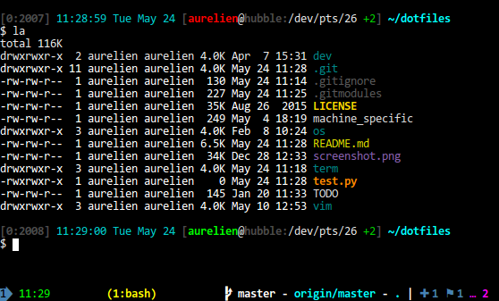

```
   ____  __ __  ____     ___  _      ____    ___  ____   __  _____
  /    ⎞⎟  ⎞  ⎞⎟    \   /  _]⎟ ⎞    l    ⎠  /  _]⎟    \ ⎛  ⎟/ ___/
 ⎛  A  ⎟⎟  ⎟  ⎟⎟  D  ) /  [_ ⎟ ⎟     ⎟  ⎛  /  [_ ⎟  _  ⎞⎩_ (   \_
 ⎟     ⎟⎟  ⎟  ⎟⎟    / ⎛    _]⎟ l___  ⎟  ⎟ ⎛    _]⎟  ⎟  ⎟  \⎠\__  ⎞
 ⎟  _  ⎟⎟  :  ⎟⎟    \ ⎟   [_ ⎟     ⎞ ⎟  ⎟ ⎟   [_ ⎟  ⎟  ⎟    /  \ ⎟
 ⎟  ⎟  ⎟⎟     ⎟⎟  .  ⎞⎟     ⎞⎟     ⎟_⎠  l ⎟     ⎞⎟  ⎟  ⎟    \    ⎟
 ⎩__⎠__⎠\__,__⎠⎩__⎠\_⎠⎩_____⎠⎩_____⎠⎩____⎠⎣_____⎠⎩__⎠__⎠     \___j
  ___     ___   ______  _____  ____  _        ___  _____
 ⎟   \   /   \ ⎟      ⎞⎟     ⎟l    ⎞⎟ ⎞      /  _]/ ___/
 ⎟    \ /     ⎞⎟      ⎟⎟   __⎠ ⎟  ⌠ ⎟ ⎟     /  [_(   \_ 
 ⎟  D  ⎞|  O  ⎟⎝_⌠  ⌡_⌡⎟  l_   ⎟  ⎟ ⎟ l___ ⎛    _]\__  ⎞
 ⎟     ⎟|     ⎟  ⎟  ⎟  ⎟   _]  ⎟  ⎟ ⎟     ⎞⎟   [_ /  \ ⎟
 ⎟     ⎟⎝     ⎠  ⎟  ⎟  ⎟  T    ⎠  ⎝ ⎟     ⎟⎟     T\    ⎟
 ⎩_____⎠ \___/   ⎩__⎠  ⎩__⎠   ⎟____⎠⎩_____⎠⎩_____⎠ \___⎠
```


# Welcome to my dotfiles config!
----

This repository is my personal collection of dotfiles, they are installed on all my boxes, at home, at work and I use them everyday!

Feel free to use, fork, clone, improve!

My dotfiles are managed with the excellent [GNU Stow](http://www.gnu.org/software/stow/),
available by default on every NIX system package manager, nothing else is needed.
Dot files and dot folders are encapsulated into 4 main stow packages

 + No error-prone homemade install script
 + Home folder is not polluted with version control files
 + simplicity
 + sobriety
 + clean organization 


## Stow packages
----

 Stow packages are simple folders located under the repository root. They represent and contain the 4
 categories of dotfiles:
 
+ os: operating system global configuration files
+ vim: full vim configuration (plugins, colorschemes, etc.)
+ dev: software development tools config
+ term: terminal configuration

### How to Use?

`cd` to your home directory and `git clone` this repository (or your fork, which i suggest) : 

```sh
cd $HOME
git clone github.com/USERNAME/dotfiles
cd dotfiles
```

It's important that your dotfiles repository is located under your HOME, so that you can simply do:
```
stow PACKAGE_NAME
```
You can also install multiple packages at once. This will install everything:
```
stow dev os term vim
```

#### dev package

Global configuration for development tools like pylint, gdb and git

#### os package

 - *Consolas* font, patched for use with [Vim lightline](https://github.com/itchyny/lightline.vim)
 - `.profile`
 - a simple system that lets you have some *unversioned* machine-specific settings


#### term package

Package aimed at improving your terminal and bash shell. Some dotfiles are bash-specific but this package also contains some shell-agnostic stuff :

+ highly customized tmux config: status-bar, 256 colors, loads of bindings, tmux-git and more.
+ a powerful inputrc (global readline configuration file) improving your productivity with each of
 your tools internally relying on readline (so virtually everywhere you can write!). Every feature
 is detailed in the comments in [.inputrc](./term/.inputrc)
+ bash config files
+ typing `git_prompt` in the shell brings you [git-prompt](https://github.com/magicmonty/bash-git-prompt)
+ A clear and informative prompt with colorful .dircolors [github.com/trapd00r/LS_COLORS](https://github.com/trapd00r/LS_COLORS)



#### vim package

I use to manage my plugins, the main ones are:

 - [nerdtree](https://github.com/scrooloose/nerdtree)
 - [vim-go](https://github.com/fatih/vim-go)
 - [vim-fugitive](https://github.com/tpope/vim-fugitive)
 - [taglist](https://github.com/vim-scripts/taglist.vim)
 - [vim-repeat](https://github.com/tpope/vim-repeat)
 - [vim-surround](https://github.com/tpope/vim-surround)
 - [ctrlp](https://github.com/ctrlpvim/ctrlp.vim)
 - [lightline](https://github.com/itchyny/lightline.vim)
 - [YouCompleteMe](https://github.com/Valloric/YouCompleteMe)

My vimrc is well categorized and commented so that you and I easily find what we are looking for
There are a lot of colorschemes, I change them often but eventually come back to [desert256](https://github.com/brafales/vim-desert256)

## Disclaimer

I only use Linux (Debian-based) OSes so i can't guarantee those configurations
will work anywhere else, not even that you will like any of it ;-)
That being said, mostly everything should work out of the box or with some minor
changes, adaptations or renamings in order to make it work on other Linux
distros or OSX (A lot of good stuff was found on other dotfiles repos that
were targeting OSX)

Keep in mind that these dotfiles have been slowly and carefully crafted to suit MY needs. I update them regularly as my needs or humour change.
Anyway, share, transform, use it as a source of inspiration. I'd happy to hear from you
if that was useful


### Credits and Thanks

+ [Paulirish's Dotfiles](https://github.com/paulirish/dotfiles).
+ I decided to use GNU stow to manage my dotfiles after reading [Using GNU Stow to manage your dotfiles](http://brandon.invergo.net/news/2012-05-26-using-gnu-stow-to-manage-your-dotfiles.html).
- Ascii art generated on [bigtext.org](http://bigtext.org/).
- To everybody developing and maintaining the project, files and plugins found here.

### TODO

+ Make use of Git sub-modules for externally for dot files and folders externally maintained.
+ Add useful shell functions, scripts and binaries (through .functions?)

### [LICENSE](LICENSE)


